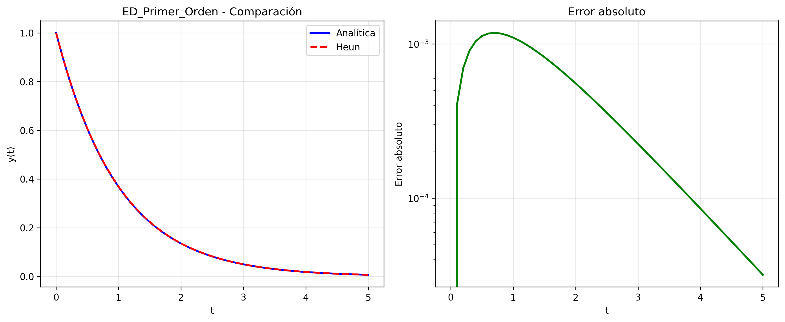
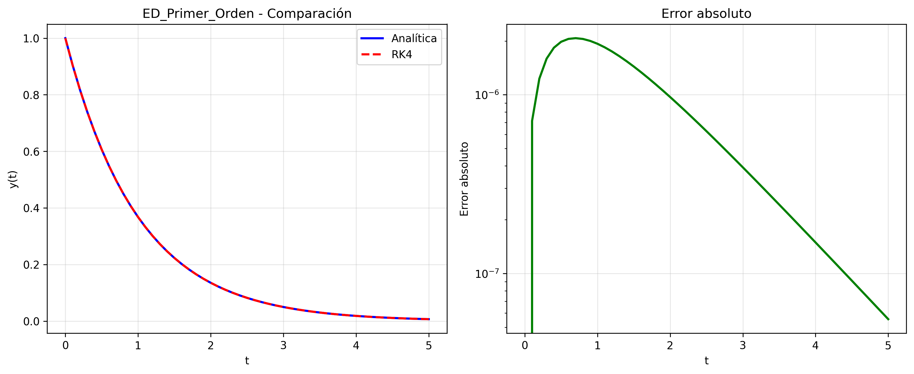
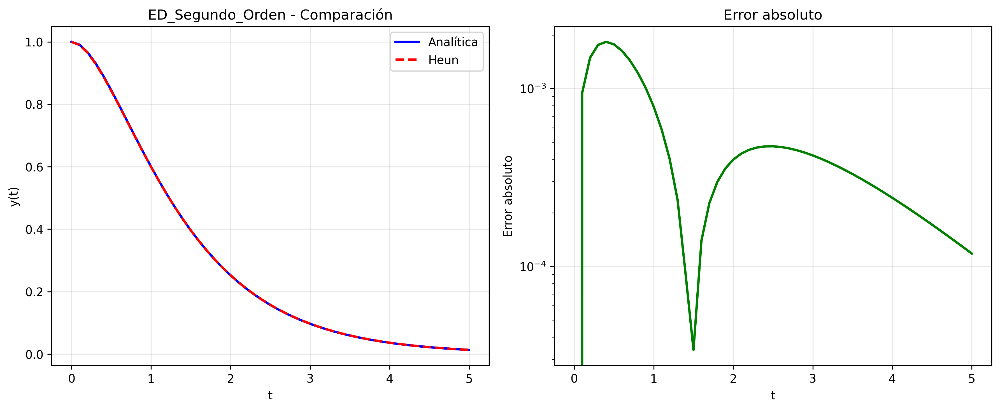
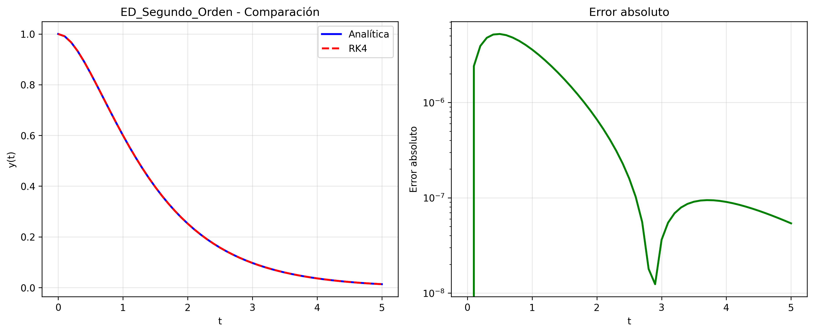
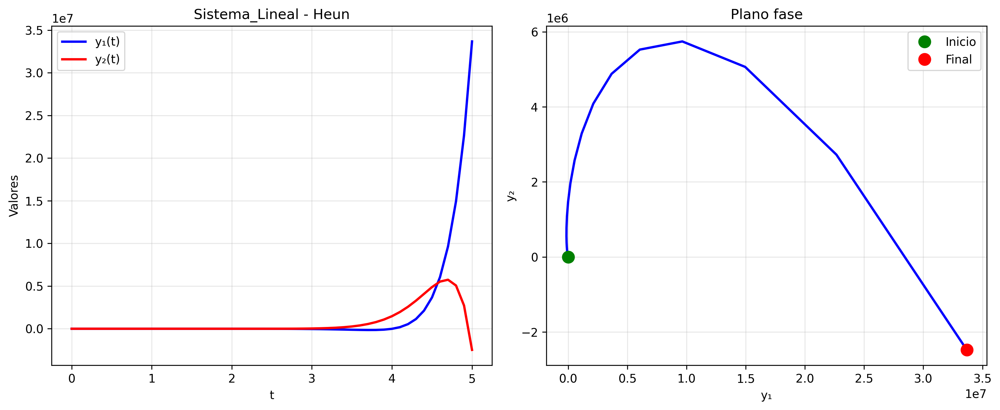
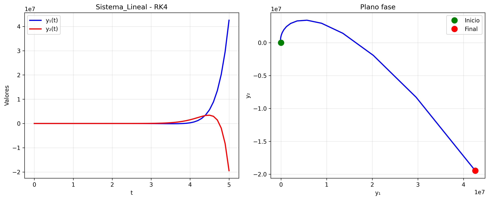
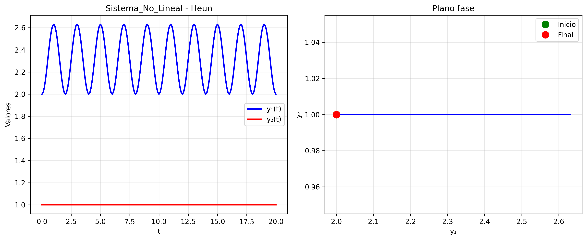
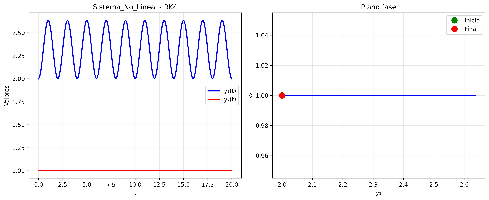

# Proyecto Final - Ecuaciones Diferenciales
Este proyecto implementa y compara dos métodos numéricos iterativos para resolver ecuaciones diferenciales ordinarias (EDO):

 1. Método de Heun (Euler Mejorado)
 2. Método de Runge-Kutta de 4º Orden (RK4)

El código resuelve y valida cuatro tipos de problemas:

 - ✅ Ecuación diferencial de primer orden
 - ✅ Ecuación diferencial de segundo orden
 - ✅ Sistema de ecuaciones 2x2 lineal
 - ✅ Sistema de ecuaciones 2x2 no lineal (sin solución analítica)

## 📦 Instalación
Requisitos:
```bash
pip install numpy matplotlib pandas
```

Ejecución:
```bash
python .\Proyecto.py
```

## 🔬 Ecuaciones Resueltas
**1. ED de Primer Orden**
```bash
y'(t) + 2y(t) = e^(-t)
Condición inicial: y(0) = 1
```

**2. ED de Segundo Orden**
```bash
y''(t) + 3y'(t) + 2y(t) = 0
Condiciones iniciales: y(0) = 1, y'(0) = 0
```

**3. Sistema 2x2 Lineal**
```bash
x'(t) = 4x(t) + y(t),   x(0) = 1
y'(t) = -2x(t) + 3y(t), y(0) = 0
```

**4. Sistema 2x2 No Lineal**
```bash
y₁'(t) = y₁ - y₁y₂ + sin(πt)
y₂'(t) = y₁y₂ - y₁

Condiciones iniciales: y₁(0) = 2, y₂(0) = 1
```

## 📷 Gráficas Generadas

**1.1 ED de Primer Orden - Método de Heun**



**1.2 ED de Primer Orden - Método RK4**



**2.1 ED de Segundo Orden - Método de Heun**



**2.2 ED de Segundo Orden - Método RK4**



**3.1 Sistema 2x2 Lineal - Método de Heun**



**3.2 Sistema 2x2 Lineal - Método RK4**



**4.1 Sistema 2x2 Lineal - Método de Heun**



**4.2 Sistema 2x2 Lineal - Método RK4**



## 📊 Interpretación de Gráficas

### Para EDs con Solución Analítica (Gráficas 1 y 2):

**Panel Izquierdo - Comparación:**
- **Línea azul:** Solución exacta (analítica)
- **Línea roja:** Solución aproximada (método numérico)
- Si ambas líneas se sobrelapan → el método es preciso
- Si se separan → hay error acumulado

**Panel Derecho - Error Absoluto:**
- Muestra qué tan lejos está la solución numérica de la exacta
- Escala logarítmica para visualizar errores pequeños
- Línea horizontal → error estable
- Línea ascendente → el error crece con el tiempo

### Para Sistemas 2x2 (Gráficas 3 y 4):

**Panel Izquierdo - Evolución Temporal:**
- **Línea azul:** Variable y₁(t) en el tiempo
- **Línea roja:** Variable y₂(t) en el tiempo
- Muestra cómo cambian ambas variables independientemente

**Panel Derecho - Plano Fase:**
- Gráfica de y₁ vs y₂ (elimina el tiempo)
- **Punto verde:** Condición inicial (donde inicia)
- **Punto rojo:** Estado final (donde termina)
- **Trayectoria:** Camino que sigue el sistema
  - *Sistema lineal:* Espirales o líneas rectas
  - *Sistema no lineal (Lotka-Volterra):* Ciclos u órbitas (presa-depredador)

## 👨‍💻 Autores

Marcelo Detlefsen - 24554

Julián Divas - 24687

Marco Diaz - 24229